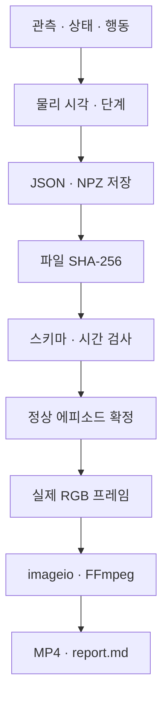
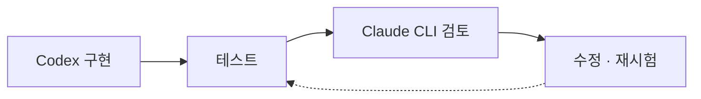
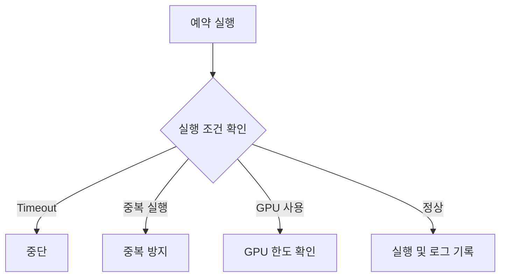

> 작성일 : Sep 30 2026

```text
[ToDo]
 오늘 최대한 과제 제출 
 리얼센스 사용 
 시이벌 머더라 
 오늘 설치할거 많으니까 각오해라

[Memo]
 OS 별로 작업이 구분 될것
 팀프로젝트로 진행

 오늘 팀구성하고 설치 작업까지 진행 할수도 

 headless 로 진행할것. GPU 의 vram을 최소화 해야하기 때문. --> 나중에 어짜피 할거니까 미리배운다고 생각할것

 문제가 졸라게 많아요. 
 > 젯슨에서는 jetpack 이라는 커널 설치 도구를 사용. 최신버전이 리눅스 26을 지원하지 않음. 10월에 jetpack 7 이 나오기는 함. 우리는 기도하는게 맞음. 채채채신 기술을 가르키고 싶은 튜터님의 열정(욕심?). 아스트로 계정을 3개를 돌려서 우리를 위한 패키지를 제작중. 

 데이터셋을 잘 선정할것. 
 이미 roscon에서는 가장 최신인 레디컬 사용중. 

 팀별 노트북 4대중
 하나는 레디컬용 (우분투)
 하나는 윈도우 (아이작심)
 ssh 연결해서 플젝 

 각 팀별 로봇이 다르기 때문에 직접 설계를 해야한다.

```

# ⚠️ 수업 시작 전 확인 사항

> ### **1. 버전·모델·장면·샘플 RGB-D 데이터 스키마를 확인한다.**
> - 사용 버전
> - 로봇 모델
> - 시뮬레이션 장면
> - 샘플 RGB-D 데이터 형식 및 스키마

> ### **2. 로컬 실행·SSH·원격 메시지 경로의 시험 결과를 확인한다.**
> - 로컬 실행
> - SSH 연결
> - 원격 메시지 전달 경로
> - 각 경로의 실제 시험 결과

> ### **3. 미검증 항목은 녹화 관측과 수학 예제로 분리하여 진행한다.**
> - 실제 녹화·관측으로 확인할 수 없는 항목
> - 수학 예제를 통한 검증
> - 두 검증 결과를 구분하여 기록

---

### 🔴 핵심

**수업 시작 전에 환경·데이터·통신 경로를 먼저 검증하고, 미검증 항목은 실제 검증 결과와 수학적 검증을 구분해서 진행한다.**

# Lv.2 M2·M3 학습 목표
- 로봇과 카메라의 좌표를 연결하여 물체 위치를 계산한다.
- 관측 결과를 이동·집기·운반의 단계별 제어로 변환한다.
- 설치·실행·실패·데이터를 재현 가능한 증거로 남긴다.
> 모듈 2 와 모듈 3 에서는 자율주행을 제외한 모든 ROS를 배운다고 생각하면 된다. 
---

# 전체 실행 워크플로우

## 실행 흐름

```mermaid
flowchart LR
    A["01<br/>환경 준비"] --> B["02<br/>모델·장면 로드"]
    B --> C["03<br/>RGB-D 관측"]
    C --> D["04<br/>좌표·도달 검사"]
    D --> E["05<br/>접근·접촉·집기"]
    E --> F["06<br/>운반·내려놓기"]
    F --> G["07<br/>상태·행동 기록"]
    G --> H["08<br/>스키마·시간 검증"]
    H --> I["09<br/>영상·NPZ·report.md"]

    classDef setup fill:#E8F1FF,stroke:#4A78C2,stroke-width:3px,color:#111,font-size:18px;
    classDef perception fill:#E8F8F0,stroke:#3A9D70,stroke-width:3px,color:#111,font-size:18px;
    classDef action fill:#FFF3D6,stroke:#D89B20,stroke-width:3px,color:#111,font-size:18px;
    classDef record fill:#F3E8FF,stroke:#8A55B8,stroke-width:3px,color:#111,font-size:18px;
    classDef output fill:#FFE8E8,stroke:#C94C4C,stroke-width:4px,color:#111,font-size:18px;

    class A,B setup;
    class C,D perception;
    class E,F action;
    class G,H record;
    class I output;
```



### 단계 구분

```text
🟦 준비
환경 준비 → 모델·장면 로드

🟩 관측
RGB-D 관측 → 좌표·도달 검사

🟨 행동
접근·접촉·집기 → 운반·내려놓기

🟪 기록·검증
상태·행동 기록 → 스키마·시간 검증

🟥 결과물
영상 · NPZ · report.md
```

> **핵심 원칙**
>
> 각 단계의 완료 여부는 **명령 전송 여부가 아니라 실제로 관측된 결과**를 기준으로 판정한다.

# 수업 순서 ① — 좌표와 물리

| 강의 | 시간 | 주제 |
|---|---:|---|
| 9강 | 4h | 로봇 모델·FK |
| 16강 | 4h | OpenCV·RGB-D 배열 |
| 17강 | 4h | 핀홀·깊이·왜곡 |
| 10강 | 4h | IK·도달 가능성 |
| 18강 | 4h | PnP·외부 자세 |
| 11강 | 4h | Jacobian·차동구동 |
| 12강 | 3h | 동역학·PhysX |

# 장비별 실행 역할

- **Windows:** Isaac Sim·PhysX·RGB-D·headless 실행을 담당한다.
- **Linux:** ROS 2 Lyrical·관측 처리·기구학·제어를 담당한다.
- **Isaac ROS Resize:** 지원되는 Linux GPU 환경에서 검증한다.

# 데이터 기록과 내보내기



> **핵심:** 단위·프레임·버전·실행 명령이 함께 있어야 재현 가능한 기록이 된다.

# 검증과 AI 개발 워크플로우

### 1. 검증 원칙

> 정상 통과뿐만 아니라 **순서·시간이 뒤집히는 상황과 미래 관측 거부**도 시험한다.

### 2. AI 개발 사이클



### 3. 실행 안전 조건



| 항목 | 적용 내용 |
|---|---|
| **검증** | 정상 통과 + 순서/시간 역전 + 미래 관측 거부 |
| **개발** | Codex 구현 → 테스트 → Claude CLI 검토 → 수정·재시험 |
| **예약 실행** | Timeout · 중복 방지 · GPU 한도 · 로그 기록 |