# 🎮 《용사님, 일단 마을부터 구해주세요》 게임 규칙 및 가이드 (`rules.md`)

<div align="center">


</div>

---

## 🧭 바로가기 네비게이션 (Quick Nav Bar)

| 📍 주요 장소 바로가기 | 👤 플레이어 메뉴 | 📜 핵심 규칙 |
| :--- | :--- | :--- |
| 🏘️ [작은마을](./작은마을/README.txt) | 📋 [용사님 상태창](./플레이어/상태.txt) | 🗺️ [세계 지도 & 구조](#-2-세계-지도--폴더-구조-map-directory-structure) |
| 🌲 [푸른 이끼 숲](./숲/README.txt) | 🎒 [용사님 가방](./플레이어/가방/) | 🕹️ [조작법 (CLI/GUI/모바일)](#-3-기본-조작법-how-to-play) |
| 🌾 [살랑바람 언덕](./언덕/README.txt) | 👥 [NPC 목록](./NPC/) | ⚙️ [게임 핵심 규칙](#-4-게임-핵심-규칙-core-rules) |
| 🌊 [맑은 여울 강](./강/README.txt) | 🎒 [아이템 정보](./아이템/) | 💡 [플레이 팁 & 이스터에그](#-5-깨알-플레이-팁-tips--easter-eggs) |

---

## 📌 목차 (Table of Contents)

- [📜 1. 게임 시놉시스 (Synopsis)](#-1-게임-시놉시스-synopsis)
- [🗺️ 2. 세계 지도 \& 폴더 구조 (Map Directory Structure)](#-2-세계-지도--폴더-구조-map-directory-structure)
  - [🗺️ visual World Map (Mermaid Diagram)](#-visual-world-map)
- [🕹️ 3. 기본 조작법 (How to Play)](#-3-기본-조작법-how-to-play)
  - [💻 A. 터미널(CLI) 환경에서 플레이할 때](#-a-터미널cli-환경에서-플레이할-때)
  - [📂 B. 컴퓨터 파일 탐색기(GUI) 환경에서 플레이할 때](#-b-컴퓨터-파일-탐색기gui-환경에서-플레이할-때)
  - [📱 C. 모바일 GitHub (앱 \& 브라우저) 환경에서 플레이할 때](#-c-모바일-github-앱--브라우저-환경에서-플레이할-때)
- [⚙️ 4. 게임 핵심 규칙 (Core Rules)](#-4-게임-핵심-규칙-core-rules)
- [💡 5. 깨알 플레이 팁 (Tips \& Easter Eggs)](#-5-깨알-플레이-팁-tips--easter-eggs)

---

## 📜 1. 게임 시놉시스 (Synopsis)

당신은 어느 날 아침 눈을 뜬 방랑 용사입니다.  
이름은 생각나는데 왜 여기에 있는지 기억이 나지 않습니다.

주머니에는 **12 Gold**와 작은 종이 한 장이 들어 있습니다.

> [!NOTE]
> **[촌장님의 편지]**  
> *"용사님께. 마을에 와주셔서 정말 다행이에요. 큰일이 하나 생겼답니다. - 작은마을 촌장 드림"*  
> *(종이 뒷면: "참고로 빵집은 맛있어요.")*

용사님! 작은마을로 가서 촌장님을 만나 이야기를 듣고, 마을을 위협(?)하는 여러 사건들을 해결해 주세요!

---

## 🗺️ 2. 세계 지도 & 폴더 구조 (Map Directory Structure)

### 🗺️ Visual World Map

```mermaid
flowchart TD
    Start["📜 시작 (README.txt)"] --> Village["🏘️ 작은마을"]
    Start --> Forest["🌲 푸른 이끼 숲"]
    Start --> Hill["🌾 살랑바람 언덕"]
    Start --> River["🌊 맑은 여울 강"]
    
    subgraph VillageArea ["🏘️ 작은마을 구역"]
        Village --> Chief["🏠 촌장집 (퀘스트 수주)"]
        Village --> Bakery["🍞 빵집 (빵 구매 & 서비스)"]
        Village --> Shop["🏪 잡화점 (물약, 낚싯대)"]
        Village --> Inn["🛏️ 여관 (휴식 & 지붕 사다리)"]
        Village --> Well["🕳️ 우물 (동전 던지기 & 비밀 소리)"]
    end
    
    subgraph ForestArea ["🌲 푸른 이끼 숲 구역"]
        Forest --> Rabbit["🐰 토끼굴 (사과 그리워함)"]
        Forest --> Mushroom["🍄 버섯밭 (3cm 슬라임 & 밀가루)"]
        Forest --> Tree["🌳 오래된나무 (자물쇠 & 사과)"]
    end
    
    subgraph HillArea ["🌾 살랑바람 언덕 구역"]
        Hill --> Windmill["🌬️ 풍차 (수상한 할머니 & 군고구마)"]
    end
    
    subgraph RiverArea ["🌊 맑은 여울 강 구역"]
        River --> Fishing["🎣 낚시터 (낚시 탐험 & 돌멩이)"]
    end

    classDef main fill:#4A90E2,stroke:#333,stroke-width:2px,color:#fff;
    classDef sub fill:#f9f9f9,stroke:#666,stroke-width:1px,color:#333;
    class Start,Village,Forest,Hill,River main;
    class Chief,Bakery,Shop,Inn,Well,Rabbit,Mushroom,Tree,Windmill,Fishing sub;
```



---

### 📂 폴더 및 파일 맵

```
용사님_일단마을부터구해주세요/
├── 📜 README.txt                 # 게임 시작 시놉시스 및 안내
├── 📜 rules.md                  # [현재 파일] 게임 플레이 규칙 및 가이드
├── 👤 플레이어/
│   ├── 📜 상태.txt              # [상태창] 용사님의 HP, 소지금, 퀘스트 현황
│   └── 🎒 가방/                 # [소지품] 획득한 아이템 보관 폴더
├── 🏘️ 작은마을/                  # [장소] 마을 중심가 (README.txt)
│   ├── 🏠 촌장집/                # 촌장님 대화 및 퀘스트 (README.txt)
│   ├── 🍞 빵집/                  # 갓 구운 식빵, 소보로 (README.txt)
│   ├── 🏪 잡화점/                # 회복 물약, 낚싯대, 씨앗 (README.txt)
│   ├── 🛏️ 여관/                  # 5 Gold 휴식 및 지붕 사다리 (README.txt)
│   └── 🕳️ 우물/                  # 소원 동전 & 지하 탐험 (README.txt)
├── 🌲 숲/                        # [장소] 푸른 이끼 숲 (README.txt)
│   ├── 🐰 토끼굴/                # 겁많은 하얀 토끼 (README.txt)
│   ├── 🍄 버섯밭/                # 3cm 커진 슬라임 & 잃어버린 밀가루 (README.txt)
│   └── 🌳 오래된나무/            # 나무 구멍 자물쇠 & 빨간 사과 (README.txt)
├── 🌾 언덕/                      # [장소] 살랑바람 언덕 (README.txt)
│   └── 🌬️ 풍차/                  # 수상한 할머니 & 군고구마 (README.txt)
├── 🌊 강/                        # [장소] 맑은 여울 강 (README.txt)
│   └── 🎣 낚시터/                # 낚시터 & 작은 돌멩이 (README.txt)
├── 👥 NPC/                      # [프로필] 마을 등장인물 데이터
│   ├── 📜 촌장.txt | 📜 빵집주인.txt | 📜 수상한할머니.txt
│   └── 📜 고양이.txt | 📜 토끼.txt
└── 🎒 아이템/                    # [아이템] 전체 아이템 데이터 샘플
    ├── 📜 회복사탕.txt | 📜 작은돌멩이.txt
    └── 📜 오래된열쇠.txt | 📜 이상한씨앗.txt
```

[⬆️ 맨 위로 돌아가기](#-용사님-일단-마을부터-구해주세요-게임-규칙-및-가이드-rulesmd)

---

## 🕹️ 3. 기본 조작법 (How to Play)

### 💻 A. 터미널(CLI) 환경에서 플레이할 때

| 행동 | Linux / macOS | Windows (CMD/PowerShell) | 설명 |
| :--- | :--- | :--- | :--- |
| **장소 이동** | `cd <폴더명>` | `cd <폴더명>` | 원하는 폴더(장소)로 이동합니다. (예: `cd 작은마을/빵집`) |
| **주위 둘러보기** | `ls` 또는 `ls -l` | `dir` | 현재 위치의 건물, Sub폴더, 파일 목록을 확인합니다. |
| **대화 / 읽기** | `cat <파일명>` | `type <파일명>` | `README.txt`, NPC 대화 파일 내용 등을 읽습니다. |
| **아이템 습득** | `mv <아이템.txt> ../플레이어/가방/` | `move <아이템.txt> ..\플레이어\가방\` | 발견한 아이템(.txt)을 가방 폴더로 이동시킵니다. |
| **아이템 사용/소모** | `rm 플레이어/가방/<아이템.txt>` | `del 플레이어\가방\<아이템.txt>` | 사용하거나 먹은 아이템 파일을 삭제합니다. |
| **상태 갱신** | `nano 플레이어/상태.txt` | `notepad 플레이어\상태.txt` | HP, 소지금, 진행 퀘스트 내용을 에디터로 직접 수정합니다. |
| **상위 폴더 이동** | `cd ..` | `cd ..` | 이전 장소(상위 폴더)로 돌아갑니다. |

---

### 📂 B. 컴퓨터 파일 탐색기(GUI) 환경에서 플레이할 때

1. **이동**: 폴더를 더블 클릭하여 입장합니다.
2. **조사 \& 대화**: `README.txt` 또는 `.txt` 파일을 텍스트 편집기(메모장, VS Code 등)로 열어 내용을 확인합니다.
3. **아이템 습득**: 아이템 파일(`.txt`)을 마우스 드래그 앤 드롭으로 [플레이어/가방/](./플레이어/가방/) 폴더로 이동시킵니다.
4. **상태 관리**: [플레이어/상태.txt](./플레이어/상태.txt) 파일을 열어 HP, 골드, 진행 퀘스트 상태를 갱신하고 저장합니다.

---

### 📱 C. 모바일 GitHub (앱 & 브라우저) 환경에서 플레이할 때

1. **탐험 \& 대화**: 
   - GitHub 앱 또는 스마트폰 브라우저에서 폴더([작은마을](./작은마을/README.txt), [숲](./숲/README.txt) 등)를 터치해 이동합니다.
   - `README.txt` 및 NPC/장소 `.txt` 파일을 터치하여 스토리를 확인합니다.
2. **상태 관리 (`상태.txt`)**: 
   - [플레이어/상태.txt](./플레이어/상태.txt) 파일 우상단의 **연필(✏️) 편집 버튼**을 눌러 HP, Gold, 퀘스트를 수정한 후 **Commit**하여 저장합니다.
3. **아이템 관리**:
   - **앱**: [플레이어/가방/](./플레이어/가방/) 폴더에서 **파일 생성(+)**으로 아이템을 만들거나 수정합니다.
   - **모바일 브라우저 / Codespaces**: Safari/Chrome 접속 시 파일 삭제가 수월하며, **GitHub Codespaces**를 실행하면 모바일에서도 웹 터미널로 CLI 명령어(`cd`, `cat`, `mv`)를 쓸 수 있습니다!

[⬆️ 맨 위로 돌아가기](#-용사님-일단-마을부터-구해주세요-게임-규칙-및-가이드-rulesmd)

---

## ⚙️ 4. 게임 핵심 규칙 (Core Rules)

> [!IMPORTANT]
> **마을 안전 수칙**  
> ⚠️ **길에서 주운 돌은 절대로 함부로 먹지 마세요!** (용사님의 소중한 위장과 품위를 지켜주세요.)

### 1️⃣ 탐험 및 조사 (Exploration)
- 새로운 폴더에 진입하면 가장 먼저 `README.txt`를 읽으세요.
- 장소에 따라 선택지, 힌트, 숨겨진 사다리나 구멍이 기재되어 있습니다.

### 2️⃣ 퀘스트와 이야기 (Quests)
- 시작 직후 [작은마을 촌장집](./작은마을/촌장집/README.txt)을 방문하여 촌장님의 이야기를 들으세요.
- **촌장님의 3대 근심거리**:
  1. 숲에 나타난 **어제보다 3cm 커진 슬라임** 👾
  2. 마을의 보물 **'마을에서 가장 큰 감자'**의 행방 🥔
  3. **우물 속에서 들려오는 의문의 소리** 🕳️

### 3️⃣ 거래 및 소지금 (Economy & Gold)
- [달콤고소 빵집](./작은마을/빵집/README.txt)이나 [네잎클로버 잡화점](./작은마을/잡화점/README.txt)에서 아이템을 살 때는 소지금(`Gold`)을 차감하고, 해당 아이템을 [가방](./플레이어/가방/) 폴더로 가져옵니다.
- 💵 **초기 소지금**: `12 Gold`

### 4️⃣ 체력과 아이템 사용 (HP & Items)
- **용사님 HP**: 기본 `30 / 30`
- 회복 아이템을 복용하면 체력만큼 [상태.txt](./플레이어/상태.txt)를 더해 갱신하고, 아이템은 가방에서 삭제합니다.
- [푹신푹신 여관](./작은마을/여관/README.txt)에서 5 Gold를 지불하면 숙박하여 HP를 전액 회복할 수 있습니다.

[⬆️ 맨 위로 돌아가기](#-용사님-일단-마을부터-구해주세요-게임-규칙-및-가이드-rulesmd)

---

## 💡 5. 깨알 플레이 팁 (Tips & Easter Eggs)

> [!TIP]
> **모험에 유용한 숨겨진 정보들**

- 🍞 **빵집 주인과의 인연**: 빵집 주인은 용사님을 너무 좋아해서 방문할 때마다 기분이 좋아져 빵을 덤으로 얹어줍니다. (`빵 +1`)
- 🐈 **네 번째 고양이의 행방**: 마을 주민들은 고양이가 4마리라고 주장하지만 실제 보이는 것은 3마리 뿐입니다. 과연 사라진 4번째 고양이는 어디에?
- 🍎 **토끼의 의외의 식성**: 숲의 토끼는 당근을 좋아하지 않고, 빨간 사과 냄새를 그리워합니다.
- 👵 **풍차의 수상한 할머니**: 언덕 풍차의 할머니는 중대한 정세보다 방금 구운 군고구마를 나눠 먹길 선호하십니다.
- 🎣 **강가 낚시터**: 낚싯대를 구입하면 [낚시터](./강/낚시터/README.txt)에서 특별한 아이템이나 물고기를 낚을 수 있습니다!

---

<div align="center">

### ⚔️ 용사님, 준비가 되셨나요?
[▶️ 작은마을 탐험하러 가기](./작은마을/README.txt) | [📋 용사님 상태창 확인하기](./플레이어/상태.txt)

</div>
